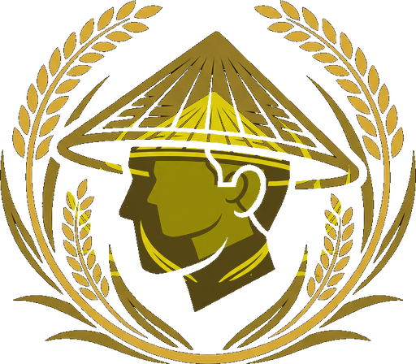

# 🌾 KrishiLink — The Harvest Experience 

<p align="center">
  
</p>

<h3 align="center">KrishiLink Promotional Webpage</h3>

<p align="center">
  <strong>An award-winning, mobile-first interactive preview of the future of Bangladesh agriculture.</strong>
</p>

<p align="center">
  
  
  
  
</p>

---

## 📖 Overview

Bangladesh's agricultural GDP contribution stands at **11.5%**, yet the sector suffers from over **$3 Billion in post-harvest losses** annually due to multi-layered middlemen, lack of direct value routing, and fragmented logistics. 

**KrishiLink** is a digital ecosystem designed to bridge this gap. This promotional webpage serves as a high-fidelity interactive sandbox showcasing the platform's core pillars:
1. **Direct Value Routing**: Eliminating multi-tiered middlemen markup layers.
2. **AI-Driven Crop Advisory**: Decentralized offline-first soil intelligence.
3. **National Logistics Infrastructure**: Proposed cold-chain corridors from Rajshahi to Sylhet.
4. **Direct Inbox Inquiries**: Powered by AJAX email submissions directly to admins.

---

## ✨ Features & Interactive Demos

### 1. 🎮 Middlemen simulator (Interactive Infographics)
- Dynamic range slider representing traditional middlemen layers (0 to 5).
- Real-time simulated statistics:
  - **Farmer Share** (increases to **42%+** under direct sandbox routing).
  - **Buyer Markup** (reduces from **+120%** to a stable direct margin).
  - **Post-Harvest Waste Rate** (simulated cold-chain routes drop waste from **35%** to **<8%**).
- Dark forest-black contrast cards optimized for budget-friendly mobile screens.

### 2. 🗺️ Proposed National Infrastructure Map
- Interactive regional hotspot selector covering Bangladesh divisions:
  - **Coastal Delta**: Salt-tolerant crop yield models.
  - **Rajshahi Division**: Projections for mangoes and wheat.
  - **Sylhet Region**: Tea belt supply integration.
  - **Dhaka Division**: Urban hub distribution channels.
- Integrated **FarmlandCanvas 3D interactive layout** simulating terrain conditions dynamically on scroll.

### 3. 📧 Unified Form Submissions
- Direct inbox forwarding to `imamshadin004@gmail.com` using AJAX FormSubmit handlers.
- Coherent, inline processing screens with zero page redirection to maintain state:
  - **Farmer waitlist requests** (includes region/crop metadata).
  - **Buyer partnership requests** (includes corporate requirements).
  - **General inquiry portal** (includes subject and text details).

### 4. 🧭 Smooth Scroll Navigation
- Premium top navigation bar featuring the signature brand logo.
- Auto-hides gracefully when scrolling down, and reappears instantly when scrolling up.
- Zero-hamburger configuration ensuring 100% readability across viewports.

---

## 🛠️ Technical Stack

- **Framework**: [Next.js 14 (App Router)](https://nextjs.org/)
- **Styling**: [Tailwind CSS](https://tailwindcss.com/)
- **Animations**: [Framer Motion](https://www.framer.com/motion/)
- **Icons**: [Lucide React](https://lucide.dev/)
- **Forms Backend**: [FormSubmit AJAX Service](https://formsubmit.co/)

---

## 🚀 Local Installation

### 1. Clone the repository
```bash
git clone https://github.com/imamdoula004/KrishiLink-Promo-Webpage.git
cd KrishiLink-Promo-Webpage
```

### 2. Install dependencies
```bash
npm install
```

### 3. Run development server
```bash
npm run dev
```
Open [http://localhost:3000](http://localhost:3000) in your browser.

---

## 📈 Projections & Sandbox Scope
> [!NOTE]
> This repository represents a prototype showcase. All transactional data, yield improvements, and satellite telemetry overlays represent simulated sandboxes and projected targets.

---

<p align="center">
  Created for the <strong>Canadian University of Bangladesh Showcase</strong>.
</p>
